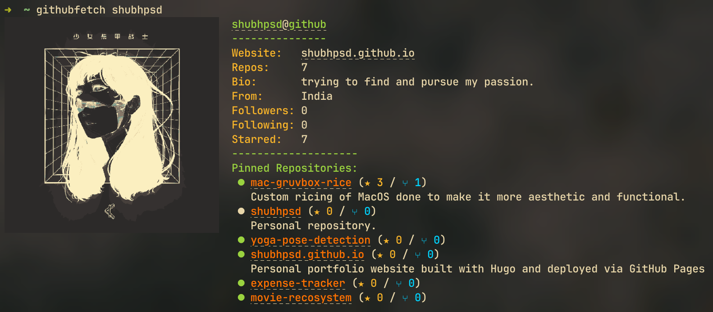

# GitHubFetch

[](https://badge.fury.io/py/githubfetch)

A terminal-based GitHub profile viewer written in Python. View GitHub profiles right in your terminal with style!



## About

GitHubFetch is a command-line tool that displays GitHub user profiles in a terminal with a nice layout inspired by system fetch tools like neofetch and fastfetch.

## Features

- 🖼️ Shows user's avatar in the terminal (using imgcat)
- 👤 Displays basic profile information (bio, location, follower count, etc.)
- 🔗 Creates clickable links to profiles and websites
- ⭐ Shows starred repositories count
- 📌 Lists pinned repositories with stars and forks
- 🎨 Uses color-coding to make information easier to read
- 📏 Automatically adjusts to your terminal size

## Installation

### Option 1: Install from PyPI (Recommended)

The easiest way to install GitHubFetch is directly from PyPI:

```bash
pip install githubfetch
```

This will install the `githubfetch` command and all its dependencies.

### Option 2: Install from Source

If you prefer to install from source:

1. Clone the repository:

   ```bash
   git clone https://github.com/shubhpsd/githubfetch.git
   cd githubfetch
   ```

2. Install the package in development mode:

   ```bash
   pip install -e .
   ```

Note: The script will automatically check for and offer to install the `imgcat` dependency on first run if it's missing.

## Usage

```bash
# View a GitHub profile
githubfetch <username>

# Configure GitHub token
githubfetch --config

# Reset GitHub token
githubfetch --reset-token

# Display help
githubfetch --help
```

For example:

```bash
githubfetch shubhpsd
```

## GitHub Token Setup

To view pinned repositories and avoid API rate limits, GitHubFetch needs a GitHub personal access token.

The first time you run the tool, it will guide you through setting up your token:

1. It will prompt you to create a token at [GitHub Developer Settings](https://github.com/settings/tokens)
2. After entering your token, it's securely saved for future use
3. Your token is stored securely in `~/.config/githubfetch/token.json`

If you need to update or reconfigure your token later:

```bash
githubfetch --config
```

Your token needs only the `read:user` scope to work properly.

## Requirements

- Python 3.6 or later
- A terminal that supports ANSI escape codes
- For image support: iTerm2 or a terminal that supports the imgcat protocol
